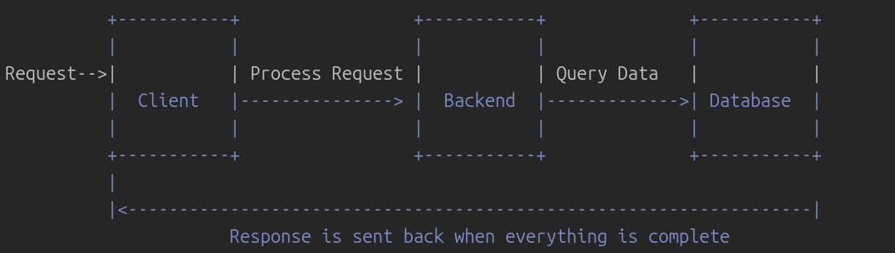
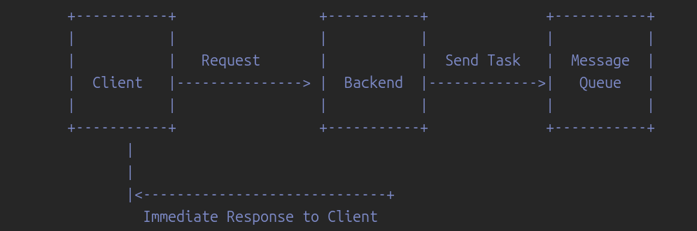
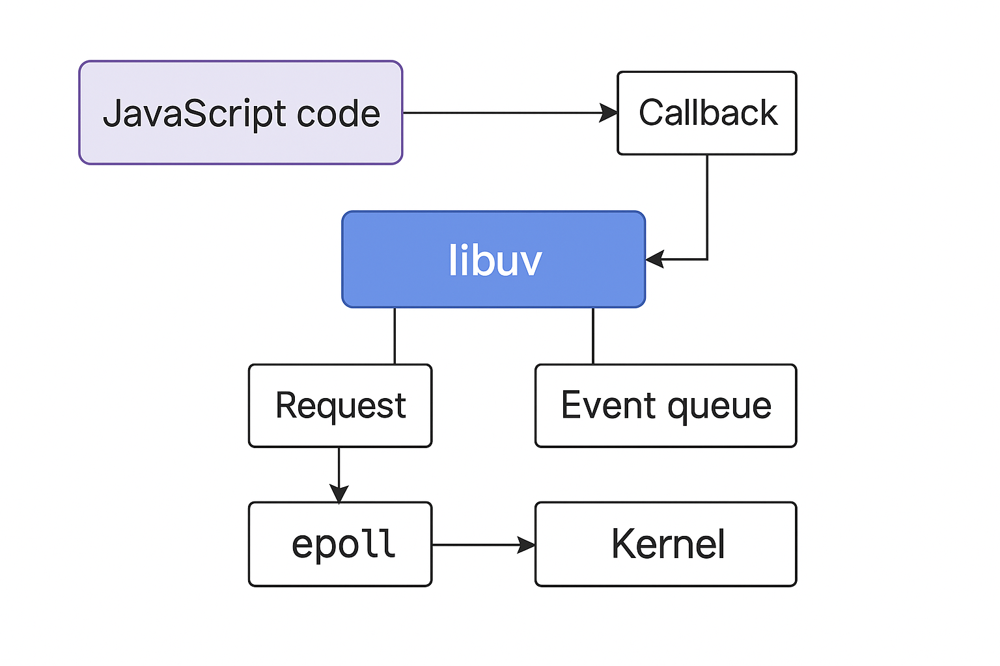

# Syncronous Vs Asyncronous

## Here's my notes from Hussien Nasser's course "Backend Engineering Fundamentals" in its second section, 2nd video

### Quick note before reading this 

+ I'm focusing on making things make sense to whoever read these notes, as when I was studying I focused on this aspect too much, and because this course is mainly for SW engineers who had work experience in backend, it was a little bit hard to understand some concepts from the first moment, but the effort I did to understand paid off :)

### What does really asyncronous and syncronous mean?

#### Here's a ChatGPT analogy that helped me ALOT

+ Synchronous Analogy:
It’s like going to a repair shop to fix something.
You go there, sit down, and wait right there until they finish fixing it.
You don’t leave or do anything else—you just stay until it’s done.

In other words:
You wait until the job is complete before moving on.

+ Asynchronous Analogy:
It’s like going to the repair shop, dropping off your item, and then leaving to do other errands.
When they finish, they call you to come pick it up.
You didn’t have to sit and wait—you continued with your tasks until you got notified.

In other words:
You send the request, go do other things, and later get notified when the job is ready.

#### What does that mean in backend processing?

##### Syncronous Backend processing
Remember we're only talking about `Backend` now, the style of processing that is done within your backend app, let's take an example for a syncronous backend app:
 
  + Backend won't respond untill response is 100% ready.
  + Backend will not do anything else untill it gets the data required for the response then sends it.
  + What if the operation needs time? what if the DB took time to process the query and gets the data back? what if it was a heavy I/O operation that will take too much time? Backend still **HAVE TO WAIT AND DO NOTHING ELSE UNTILL IT'S COMPLETED**. Did you notice the issue? Remember the previous analogy, **WHY NOT TO DO STH ELSE INSTEAD OF JUST WAITING AND WASTE ALOT OF TIME?**.

> _Important Note_: We're talking now about the backend side not the client side, you know, even in this scenario the client doesn't have to be blocked, and here where async/await and asyncronous programming comes into place, but we're now talking about the backend aspect.

##### Asyncronous Backend processing
+ Here, backend **CAN** do sth while waiting.
 

  + Backend responds immeditely with a job id, client can later check if response is ready or not using this job id.
  + Backend doesn't have to be blocked untill job is completed, it can utilize the time to work on other jobs.
  + When job is completed, client can recieve a response.

### Some JavaScript things.

#### How Node.js handles I/O operations asyncronously

 

+ Let's see you wrote this line of code to read a file, which actually sends a request to libuv, which is  C library in node.js, responsible for managing the I/O operations.

```
fs.readFile('file.txt', (err, data) => {
  if (err) throw err;
  console.log(data.toString());
});
```

+ libuv talks to the OS kernel, request it to read this file.
+ Kernel actually reads the file from the disk. But, in this time, libuv isn't blocked, it can recieve other requests while waiting for the kernel to finish, and sends a request to epoll ((if we're in linux)) to be notified when the process is completed.
+ When file is read, kernel responds to epoll, epoll responds to libuv, which then responds to the app.
+ libuv also stores the callback that should be executed when the file is read.


### Thank you.
